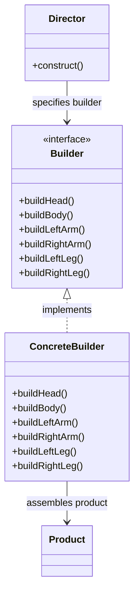

## 建造小人一

```java
class Test extends JFrame {
    public Test() {
        setSize(400, 400);
        setDefaultCloseOperation(JFrame.EXIT_ON_CLOSE);
        setLocationRelativeTo(null);
    }
    public void paint(Graphics g) {
        g.drawOval(100, 100, 200, 200); // Draw a head
        g.drawRect(150, 150, 100, 100); // Draw a body
        g.drawLine(200, 100, 200, 50);  // Draw a left arm
        g.drawLine(200, 100, 250, 50);  // Draw a right arm
        g.drawLine(200, 250, 150, 300); // Draw a left leg
        g.drawLine(200, 250, 250, 300); // Draw a right leg
    }
    public static void main(String[] args) {
        Test t = new Test();
        t.setVisible(true);
    }
}
```

## 建造小人二

```java
class PersonThinBuilder {
    private Graphics g;

    public PersonThinBuilder(Graphics g) {
        this.g = g;
    }

    public void build() {
        g.drawOval(100, 100, 200, 200); // Draw a head
        g.drawRect(150, 150, 100, 100); // Draw a body
        g.drawLine(200, 100, 200, 50);  // Draw a left arm
        g.drawLine(200, 100, 250, 50);  // Draw a right arm
        g.drawLine(200, 250, 150, 300); // Draw a left leg
        g.drawLine(200, 250, 250, 300); // Draw a right leg
    }
}

public void paint(Graphics g) {
    PersonThinBuilder builder = new PersonThinBuilder(g);
    builder.build();
    PersonFatBuilder fatBuilder = new PersonFatBuilder(g);
    fatBuilder.build();
}
```

## 建造者模式
* 將一個複雜物件的建構與它的表示分離，使得同樣的建構過程可以建立不同的表示
* 如果我們用了建造者模式，那麼使用者就只需指定需要建造的類型就可以得到它們，而具體建造的過程和細節就不需知道了
* 建造者模式（Builder）將一個複雜的物件的建構與它的表示分離，使得同樣的建構過程可以創建不同的表示

```java
abstract class PersonBuilder {
    protected Graphics g;

    public PersonBuilder(Graphics g) {
        this.g = g;
    }

    public abstract void buildHead();
    public abstract void buildBody();
    public abstract void buildLeftArm();
    public abstract void buildRightArm();
    public abstract void buildLeftLeg();
    public abstract void buildRightLeg();
}

class PersonThinBuilder extends PersonBuilder {
    public PersonThinBuilder(Graphics g) {
        super(g);
    }

    public void buildHead() {
        g.drawOval(100, 100, 200, 200); // Draw a head
    }

    public void buildBody() {
        g.drawRect(150, 150, 100, 100); // Draw a body
    }

    public void buildLeftArm() {
        g.drawLine(200, 100, 200, 50); // Draw a left arm
    }

    public void buildRightArm() {
        g.drawLine(200, 100, 250, 50); // Draw a right arm
    }

    public void buildLeftLeg() {
        g.drawLine(200, 250, 150, 300); // Draw a left leg
    }

    public void buildRightLeg() {
        g.drawLine(200, 250, 250, 300); // Draw a right leg
    }
}
// Director
class PersonDirector {
    private PersonBuilder pb;

    public PersonDirector(PersonBuilder builder) {
        this.pb = builder;
    }

    public void construct() {
        pb.buildHead();
        pb.buildBody();
        pb.buildLeftArm();
        pb.buildRightArm();
        pb.buildLeftLeg();
        pb.buildRightLeg();
    }
}
```
```java
class Test extends JFrame {
    public Test() {
        setSize(400, 400);
        setDefaultCloseOperation(JFrame.EXIT_ON_CLOSE);
        setLocationRelativeTo(null);
    }

    public void paint(Graphics g) {
        PersonBuilder builder = new PersonThinBuilder(g);
        PersonDirector director = new PersonDirector(builder);
        director.construct();

        PersonBuilder fatBuilder = new PersonFatBuilder(g);
        PersonDirector fatDirector = new PersonDirector(fatBuilder);
        fatDirector.construct();
    }

    public static void main(String[] args) {
        Test t = new Test();
        t.setVisible(true);
    }
}
```

## 建造者模式解析



* 為建立一個Product物件的各個元件指定的抽象介面
* 具體建造者 實現builder介面 建構和裝配各個元件 Product 是具體的小人 產品角色
* director 是建構一個使用builder介面的物件
* 主要用於建立一些複雜的物件 這些物件內部子物件的建造順序通常是穩定的 但每個子物件本身的建構通常面臨著複雜的變化
* 建造者模式的好處就是使得建造過程與表示過程分離 由於建造者隱藏了該產品是如何組裝的 所以如果需要改變一個產品的內部表示 只需要再訂一個具體的建造者就可以了

## 建造者模式基本程式
```java
class Product {
    ArrayList<String> parts = new ArrayList<>();

    public void add(String part) {
        parts.add(part);
    }
    public void show() {
        System.out.println("Product parts: " + parts);
    }
}

abstract class Builder {
    public abstract void buildPartA();
    public abstract void buildPartB();
    public abstract Product getResult();
}

class ConcreteBuilder1 extends Builder {
    private Product product = new Product();

    public void buildPartA() {
        product.add("Part A");
    }
    public void buildPartB() {
        product.add("Part B");
    }
    public Product getResult() {
        return product;
    }
}

class ConcreteBuilder2 extends Builder {
    private Product product = new Product();

    public void buildPartA() {
        product.add("Part X");
    }
    public void buildPartB() {
        product.add("Part Y");
    }
    public Product getResult() {
        return product;
    }
}
class Director {
    private Builder builder;

    public Director(Builder builder) {
        this.builder = builder;
    }

    public void construct() {
        builder.buildPartA();
        builder.buildPartB();
    }
}

Director director = new Director();
Builder builder1 = new ConcreteBuilder1();
Builder builder2 = new ConcreteBuilder2();

director.setBuilder(builder1);
Product product1 = builder1.getResult();
product1.show();

director.setBuilder(builder2);
Product product2 = builder2.getResult();
product2.show();
```
