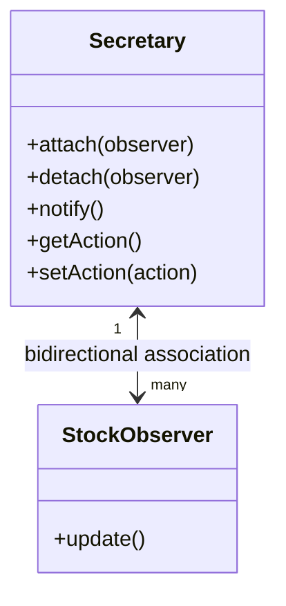
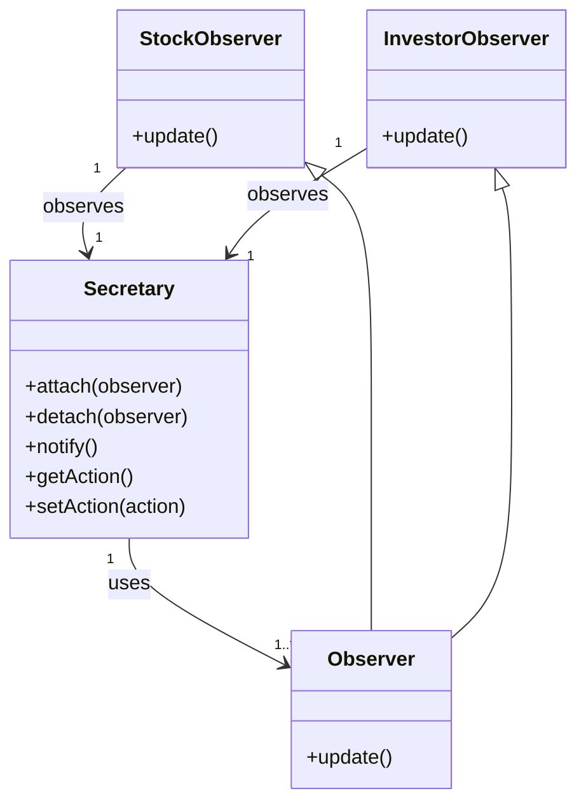
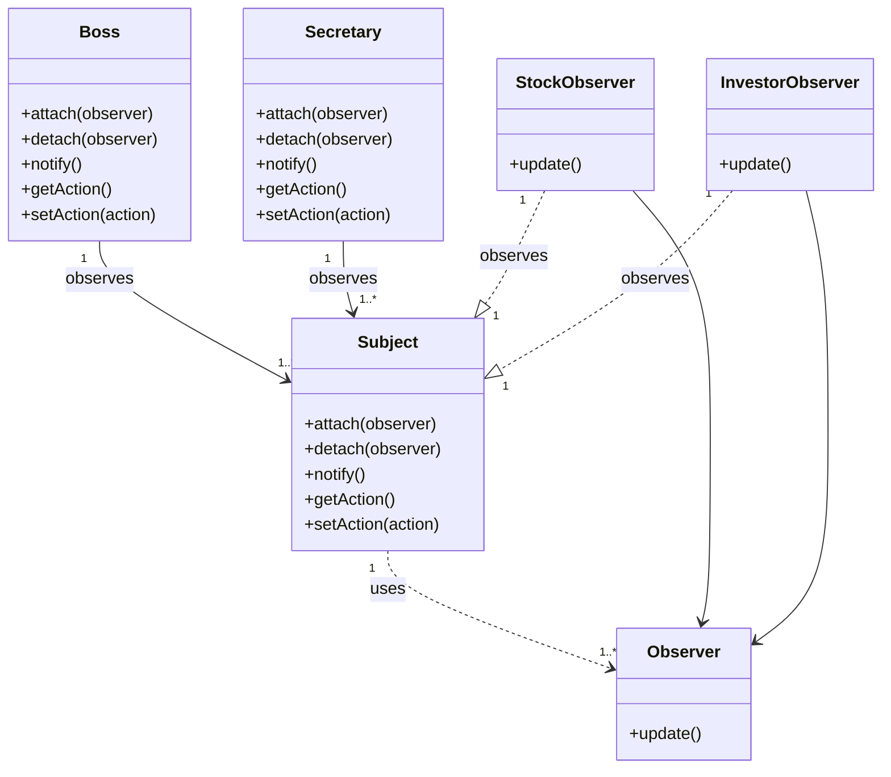

### 雙向耦合


```java
class Secretary {
    protected String name;
    public Secretary(String name) {
        this.name = name;
    }

    private ArrayList<StockObserver> list = new ArrayList<StockObserver>();
    private String action;

    public void attach(StockObserver observer) {
        list.add(observer);
    }

    public void detach(StockObserver observer) {
        list.remove(observer);
    }

    public void notifyObservers() {
        for (StockObserver observer : list) {
            observer.update();
        }
    }

    public String getAction() {
        return this.action;
    }

    public void setAction(String action) {
        this.action = action;
    }
}


class StockObserver {
    private String name;
    private Secretary secretary;

    public StockObserver(String name, Secretary secretary) {
        this.name = name;
        this.secretary = secretary;
    }

    public void update() {
        System.out.println(name + " received action: " + secretary.getAction());
    }
}

Secretary secretary = new Secretary("Alice");
StockObserver observer1 = new StockObserver("Bob", secretary);
StockObserver observer2 = new StockObserver("Charlie", secretary);

secretary.attach(observer1);
secretary.attach(observer2);
secretary.setAction("Meeting at 10 AM");
secretary.notifyObservers();
```

### 解耦實踐一


```java
abstract class Observer {
    protected String name;
    protected Secretary secretary;
    public Observer(String name, Secretary secretary) {
        this.name = name;
        this.secretary = secretary;
    }
    public abstract void update();
}

class StockObserver extends Observer {
    public StockObserver(String name, Secretary secretary) {
        super(name, secretary);
    }
    public void update() {
        System.out.println(name + " received action: " + secretary.getAction());
    }
}

class InvestorObserver extends Observer {
    public InvestorObserver(String name, Secretary secretary) {
        super(name, secretary);
    }
    public void update() {
        System.out.println(name + " received action: " + secretary.getAction());
    }
}

class Secretary {
    protected String name;
    private ArrayList<Observer> observers = new ArrayList<Observer>();
    private String action;

    public Secretary(String name) {
        this.name = name;
    }
    public void attach(Observer observer) {
        observers.add(observer);
    }
    public void detach(Observer observer) {
        observers.remove(observer);
    }
    public void notifyObservers() {
        for (Observer observer : observers) {
            observer.update();
        }
    }
    public String getAction() {
        return this.action;
    }
    public void setAction(String action) {
        this.action = action;
    }
}
```
## 解耦實踐二


```java
abstract class Subject {
    protected String name;
    public Subject(String name) {
        this.name = name;
    }

    private ArrayList<Observer> observers = new ArrayList<Observer>();
    private String action;
    public void attach(Observer observer) {
        observers.add(observer);
    }

    public void detach(Observer observer) {
        observers.remove(observer);
    }

    public void notifyObservers() {
        for (Observer observer : observers) {
            observer.update();
        }
    }
    public String getAction() {
        return this.action;
    }
    public void setAction(String action) {
        this.action = action;
    }
}

class Boss extends Subject {
    public Boss(String name) {
        super(name);
    }
}

class Secretary extends Subject {
    public Secretary(String name) {
        super(name);
    }
}

abstract class Observer {
    protected String name;
    protected Subject subject;
    public Observer(String name, Subject subject) {
        this.name = name;
        this.subject = subject;
    }
    public abstract void update();
}
class StockObserver extends Observer {
    public StockObserver(String name, Subject subject) {
        super(name, subject);
    }
    public void update() {
        System.out.println(name + " received action: " + subject.getAction());
    }
}
class InvestorObserver extends Observer {
    public InvestorObserver(String name, Subject subject) {
        super(name, subject);
    }
    public void update() {
        System.out.println(name + " received action: " + subject.getAction());
    }
}

Subject boss = new Boss("Boss");

Observer stockObserver1 = new StockObserver("Stock Observer 1", boss);
Observer stockObserver2 = new StockObserver("Stock Observer 2", boss);
Observer investorObserver1 = new InvestorObserver("Investor Observer 1", boss);

boss.attach(stockObserver1);
boss.attach(stockObserver2);
boss.attach(investorObserver1);

boss.detach(stockObserver1); // Detach one observer, so it won't receive updates

boss.setAction("Meeting at 10 AM");
boss.notifyObservers();

```

### 觀察者模式
* 觀察者模式又叫做發布-訂閱模式（Publish-Subscribe Pattern）
* 觀察者模式定義了一種一對多的依賴關係，讓多個觀察者物件同時監聽某一個主題物件。這個主題物件在狀態發生變化時，會通知所有觀察者物件，使他們能夠自動更新自己。

```java
abstract class Subject {
    private ArrayList<Observer> observers = new ArrayList<Observer>();

    public void attach(Observer observer) {
        observers.add(observer);
    }

    public void detach(Observer observer) {
        observers.remove(observer);
    }

    public void notifyObservers() {
        for (Observer observer : observers) {
            observer.update();
        }
    }
    protected String subjectState;
    public String getSubjectState() {
        return this.subjectState;
    }
    public void setSubjectState(String state) {
        this.subjectState = state;
    }
}

abstract class Observer {
    public abstract void update();
}

class ConcreteSubject extends Subject {
    // 具體主題類別
}

class ConcreteObserver extends Observer {
    private String name;
    private Subject subject;

    public ConcreteObserver(String name, Subject subject) {
        this.name = name;
        this.subject = subject;
    }

    public void update() {
        System.out.println(name + " received update: " + subject.getSubjectState());
    }
}

Subject subject = new ConcreteSubject();
subject.attach(new ConcreteObserver("Observer 1", subject));
subject.attach(new ConcreteObserver("Observer 2", subject));
subject.setSubjectState("State changed");
subject.notifyObservers();
```
### 觀察者模式的特點
* 將一個系統分割成一系列相互協作的類別有一個很不好的副作用，那就是需要維護相關物件間的一致性。我們不希望為了維持一致性而使各類緊密耦合，這會給維護、擴充和重用都帶來不便。
* 當一個物件的改變需要同時改變其他物件的時候，觀察者模式可以解決這個問題。
* 而且他不知道有多少物件有待改變時，應該考慮使用觀察者模式。
* 當一個抽象模型有兩個方面，其中一方面依賴於另一方面，這時用觀察者模式可以將這兩者封裝在獨立的物件中，使他們各自獨立地改變和重複使用。
* 觀察者模式所做的工作其實在解除耦合。讓耦合的雙方都依賴抽象，而非依賴於具體。從而使得各自的變化都不會影響另一邊的變化。