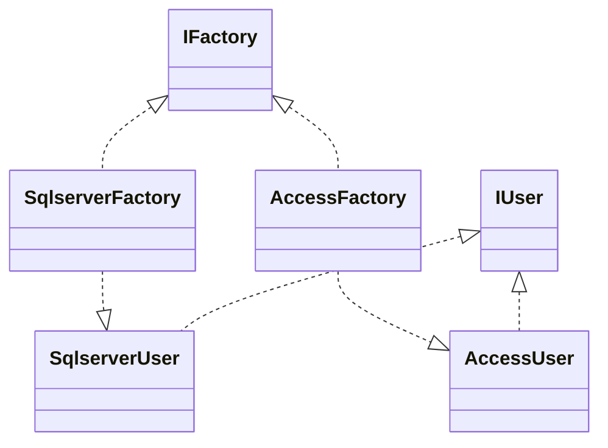
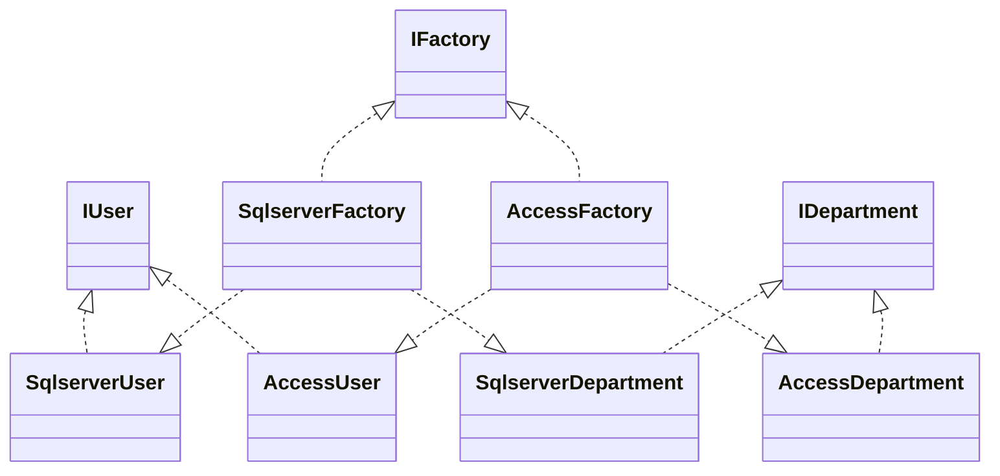
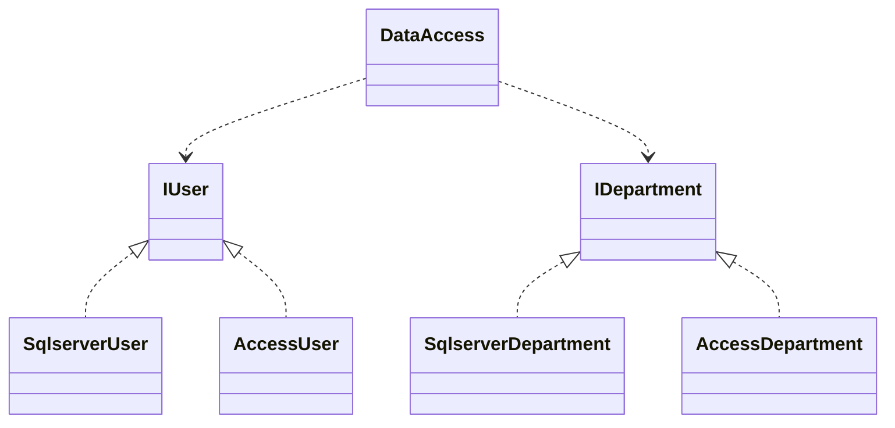

## 最基本的資料存取程式

```java
public class User {
    private int _id;
    public int getId() {
        return this._id;
    }
    public void setId(int id) {
        this._id = id;
    }

    private String _name;
    public String getName() {
        return this._name;
    }
    public void setName(String name) {
        this._name = name;
    }
}

public class SqlserverUser {
    public void insert(User user) {
        System.out.println("insert a user into Sqlserver database");
    }
    public User getUser(int id) {
        System.out.println("get a user from Sqlserver database");
        return null;
    }
}

User user = new User();
SqlserverUser sqlserverUser = new SqlserverUser();
sqlserverUser.insert(user);
sqlserverUser.getUser(1);
```

## 用工廠方法模式的資料存取程式



```java
// IUser
public interface IUser {
    void insert(User user);
    User getUser(int id);
}

// SqlserverUser
public class SqlserverUser implements IUser {
    public void insert(User user) {
        System.out.println("insert a user into Sqlserver database");
    }
    public User getUser(int id) {
        System.out.println("get a user from Sqlserver database");
        return null;
    }
}

// AccessUser
public class AccessUser implements IUser {
    public void insert(User user) {
        System.out.println("insert a user into Access database");
    }
    public User getUser(int id) {
        System.out.println("get a user from Access database");
        return null;
    }
}

// IFactory
public interface IFactory {
    IUser createUser();
}

// SqlserverFactory
public class SqlserverFactory implements IFactory {
    public IUser createUser() {
        return new SqlserverUser();
    }
}

// AccessFactory
public class AccessFactory implements IFactory {
    public IUser createUser() {
        return new AccessUser();
    }
}

// Client code
User user = new User();
SqlserverFactory factory = new SqlserverFactory();
IUser sqlserverUser = factory.createUser();

sqlserverUser.insert(user);
sqlserverUser.getUser(1);
```

## 用抽象工廠模式的資料存取程式



```java
// IDepartment
public interface IDepartment {
    void insert(Department department);
    Department getDepartment(int id);
}
// SqlserverDepartment
public class SqlserverDepartment implements IDepartment {
    public void insert(Department department) {
        System.out.println("insert a department into Sqlserver database");
    }
    public Department getDepartment(int id) {
        System.out.println("get a department from Sqlserver database");
        return null;
    }
}

// AccessDepartment
public class AccessDepartment implements IDepartment {
    public void insert(Department department) {
        System.out.println("insert a department into Access database");
    }
    public Department getDepartment(int id) {
        System.out.println("get a department from Access database");
        return null;
    }
}

// IFactory
public interface IFactory {
    IUser createUser();
    IDepartment createDepartment();
}

// SqlserverFactory
public class SqlserverFactory implements IFactory {
    public IUser createUser() {
        return new SqlserverUser();
    }
    public IDepartment createDepartment() {
        return new SqlserverDepartment();
    }
}

// AccessFactory
public class AccessFactory implements IFactory {
    public IUser createUser() {
        return new AccessUser();
    }
    public IDepartment createDepartment() {
        return new AccessDepartment();
    }
}

// Client code
User user = new User();
Department department = new Department();

IFactory factory = new SqlserverFactory();
IUser sqlserverUser = factory.createUser();
sqlserverUser.insert(user);
sqlserverUser.getUser(1);

IDepartment sqlserverDepartment = factory.createDepartment();
sqlserverDepartment.insert(department);
sqlserverDepartment.getDepartment(2);
```

## 抽象工廠模式
* 抽象工廠模式 (Abstract Factory) 提供一個創建一系列相關或相互依賴物件的介面，而無須指定它們具體的類別

## 抽象工廠的優缺點
* 好處是可以交換產品系列，由於具體工廠類別在一個應用中只需要在初始化的時候出現一次，這使得改變一個應用的具體工廠變得容易，只需要改變具體工廠即可使用不同的產品設定
* 它讓具體的建立實例過程與用戶端分離，用戶端是透過它們的抽象介面操縱實例，產品的具體類別名稱也被具體工廠的實現分離，不會出現在客戶程式中
* 缺點是增加專案 Project 至少要增加三個類別 IProject, SqlserverProject, AccessProject，還要改 IFactory, SqlserverFactory, AccessFactory...



```java
// DataAccess
public class DataAccess {
    private static String db = "Sqlserver"; 

    public static IUser createUser() {
        IUser user = null;
        switch (db) {
            case "Sqlserver":
                user = new SqlserverUser();
                break;
            case "Access":
                user = new AccessUser();
                break;
        }
        return user;
    }

    public static IDepartment createDepartment() {
        IDepartment department = null;
        switch (db) {
            case "Sqlserver":
                department = new SqlserverDepartment();
                break;
            case "Access":
                department = new AccessDepartment();
                break;
        }
        return department;
    }
}
// Client code
User user = new User();
Department department = new Department();

IUser sqlserverUser = DataAccess.createUser();
sqlserverUser.insert(user);
sqlserverUser.getUser(1);

IDepartment sqlserverDepartment = DataAccess.createDepartment();
sqlserverDepartment.insert(department);
sqlserverDepartment.getDepartment(2);
```

## 用反射+抽象工廠模式的資料存取程式

```java
// DataAccess
public class DataAccess {
    private static String assemblyName = "com.example"; // assembly name
    private static String db = "Sqlserver"; 

    public static IUser createUser() {
        return (IUser)getInstance(assemblyName + db + "User");
    }

    public static IDepartment createDepartment() {
        return (IDepartment)getInstance(assemblyName + db + "Department");
    }

    private static Object getInstance(String className){
        Object result = null;
        try {
            result = Class.forName(className).getDeclaredConstructor().newInstance();
        } catch (Exception e) {
            e.printStackTrace();
        }
        return result;
    }
}
```

## 用反射+抽象工廠模式的資料存取程式

```java
import java.io.BufferedReader;
import java.io.FileReader;
import java.io.IOException;
import java.util.Properties;


public class DataAccess {
    private static String assemblyName = "com.example"; // assembly name
    
    public static String getDb() {
        String result = null;
        try {
            Properties properties = new Properties();
            String path = System.getProperty("user.dir") + "/config.properties";
            System.out.println("Loading properties from: " + path);
            BufferedReader reader = new BufferedReader(new FileReader(path));
            properties.load(reader);
            result = properties.getProperty("db");
        } catch (Exception e) {
            e.printStackTrace();
        }
        return result;
    }
}

// build user object factory
public static IUser createUser() {
    String db = getDb();
    return (IUser)getInstance(assemblyName + db + "User");
}
```
## 商場收銀程式升級

```java
public class CashContext{
    private Isale cs;

    public CashContext(int type) {
        Ifactory fs = null;
        switch (type) {
            case 1:
                fs = new CashRebateReturnFactory(1d,0d,0d);
                break;
            case 2: // 0.8
                fs = new CashRebateReturnFactory(0.8d,0d,0d);
                break;
            case 3: // 0.7
                fs = new CashRebateReturnFactory(0.7d,0d,0d);
                break;
            case 4: // 300 return 100
                fs = new CashRebateReturnFactory(1d,300d,100d);
                break;
            case 5: // 0.8 and 300 return 100
                fs = new CashRebateReturnFactory(0.8d,300d,100d);
                break;
            case 6: // 200 return 50 and 0.7
                fs = new CashRebateReturnFactory(0.7d,200d,50d);
                break;
        }
        this.cs = fs.createSalesModel();
    }
    public double getResult(double money, int num) {
        return this.cs.acceptCash(money, num);
    }
}
```

```data.properties
strategy1 = CashRebateReturnFactory,1d,0d,0d
strategy2 = CashRebateReturnFactory,0.8d,0d,0d
strategy3 = CashRebateReturnFactory,0.7d,0d,0d
strategy4 = CashRebateReturnFactory,1d,300d,100d
strategy5 = CashRebateReturnFactory,0.8d,300d,100d
strategy6 = CashRebateReturnFactory,0.7d,200d,50d
```
### CashContext.java
```java
import java.lang.reflect.InvocationTargetException;
import java.io.BufferedReader;
import java.io.FileReader;
import java.io.IOException;
import java.util.Properties;

public class CashContext {
    private static String assemblyName = "com.example"; // assembly name
    private Isale cs;

    public CashContext(int type) {
        String[] config = getConfig(type).split(",");
        Ifactory fs = getInstance(config[0], 
                Double.parseDouble(config[1]), 
                Double.parseDouble(config[2]), 
                Double.parseDouble(config[3]));
        this.cs = fs.createSalesModel();
    }
    
    private String getConfig(int type) {
        String result = "";
        try {
            Properties properties = new Properties();
            String path = System.getProperty("user.dir") + "/data.properties";
            BufferedReader reader = new BufferedReader(new FileReader(path));
            properties.load(reader);
            result = properties.getProperty("strategy" + type);
        } catch (IOException e) {
            e.printStackTrace();
        }
        return result;
    }
    private Ifactory getInstance(String className, double param1, double param2, double param3) {
        Ifactory result = null;
        try {
            result = (Ifactory) Class.forName(assemblyName + className)
                .getDeclaredConstructor(new Class[]{double.class, double.class, double.class})
                .newInstance(new Object[]{param1, param2, param3});
        } catch (InstantiationException e) {
            e.printStackTrace();
        } catch (IllegalAccessException e) {
            e.printStackTrace();
        } catch (ClassNotFoundException e) {
            e.printStackTrace();
        } catch (NoSuchMethodException e) {
            e.printStackTrace();
        } catch (InvocationTargetException e) {
            e.printStackTrace();
        }
        return result;
    }
}
```