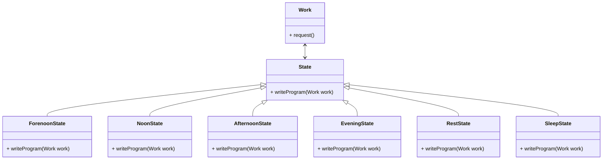

## 工作狀態 - function version

```java
static int hour = 0;
static boolean workFinished = false;

public static void writeProgram() {
    if (hour < 12) {
        System.out.println("working in the morning");
    } else if (hour < 13) {
        System.out.println("lunch time");
    } else if (hour < 17) {
        System.out.println("working in the afternoon");
    } else {
        if (workFinished) {
            System.out.println("work finished");
        } else {
            if (hour < 21) {
                System.out.println("working overtime");
            } else {
                System.out.println("go home");
            }
        }
    }
}
```

## 工作狀態 - class version

```java
class Work {
    private int hour;
    private boolean workFinished = false;

    public int getHour() {
        return this.hour;
    }
    public void setHour(int hour) {
        this.hour = hour;
    }

    public boolean isWorkFinished() {
        return this.workFinished;
    }
    public void setWorkFinished(boolean workFinished) {
        this.workFinished = workFinished;
    }

    public void writeProgram() {
        if (hour < 12) {
            System.out.println("working in the morning");
        } else if (hour < 13) {
            System.out.println("lunch time");
        } else if (hour < 17) {
            System.out.println("working in the afternoon");
        } else {
            if (workFinished) {
                System.out.println("work finished");
            } else {
                if (hour < 21) {
                    System.out.println("working overtime");
                } else {
                    System.out.println("go home");
                }
            }
        }
    }
}
```
* 物件導向設計其實就是希望做到程式的責任分解

## 狀態模式
* 狀態模式(State)，當一個物件的內在狀態改變時允許改變其行為，這個物件看起來像是改變了其類別
* 狀態模式主要解決的是當控制一個物件狀態轉換的條件運算過於複雜時的情況，把狀態的判斷邏輯轉移到表示不同狀態的一系列類別當中，可以把複雜的判斷邏輯簡化。

### 狀態模式 UML 結構


```java
// abstract class for State
class State {
    public abstract void handle(Context context);
}

// concrete state A
class ConcreteStateA extends State {
    public void handle(Context context) {
        context.setState(new ConcreteStateB()); // change to ConcreteStateB
    }
}
// concrete state B
class ConcreteStateB extends State {
    public void handle(Context context) {
        context.setState(new ConcreteStateA()); // change to ConcreteStateA
    }
}

// context class
class Context {
    private State state;

    public Context(State state) {
        this.state = state;
    }

    public State getState() {
        return this.state;
    }

    public void setState(State state) {
        this.state = state;
    }

    public void request() {
        this.state.handle(this); // delegate the request to the current state
    }
}

// Client code
Context context = new Context(new ConcreteStateA());
context.request(); // Handling in ConcreteStateA
context.request(); // Handling in ConcreteStateB
context.request(); // Handling in ConcreteStateA
context.request(); // Handling in ConcreteStateB
```

## 狀態模式好處與用處

* 將與特定狀態相關的行為局部化，並且將不同狀態的行為分割開來
* 將特定狀態相關的行為都放入一個物件中，由於所有與狀態相關的程式都存在於某個 ConcreteState 中，所以透過定義新的子類別可以很容易地增加新的狀態和轉換
* 消除龐大的條件分支敘述
* 狀態模式透過把各種狀態轉移邏輯分布到 State 的子類別之間，來減少相互間的依賴
* 當一個物件的行為取決於它的狀態，並且必須在執行時期根據狀態改變它的行為時，就可以考慮使用狀態模式


## 工作狀態 - 狀態模式版




```java
// abstract class for State
abstract class State {
    public abstract void writeProgram(Work work);
}

// concrete state for morning
class ForenoonState extends State {
    public void writeProgram(Work work) {
        if (work.getHour() < 12) {
            System.out.println("working in the morning");
        } else {
            work.setState(new NoonState());
            work.writeProgram();
        }
    }
}

// concrete state for noon
class NoonState extends State {
    public void writeProgram(Work work) {
        if (work.getHour() < 13) {
            System.out.println("lunch time");
        } else {
            work.setState(new AfternoonState());
            work.writeProgram();
        }
    }
}

// concrete state for afternoon
class AfternoonState extends State {
    public void writeProgram(Work work) {
        if (work.getHour() < 18) {
            System.out.println("working in the afternoon");
        } else {
            work.setState(new EveningState());
            work.writeProgram();
        }
    }
}

// concrete state for evening
class EveningState extends State {
    public void writeProgram(Work work) {
        if (work.isWorkFinished()) {
            work.setState(new RestState());
            work.writeProgram();
            System.out.println("work finished");
        } 
        else{
            if (work.getHour() < 21) {
                System.out.println("working overtime");
            } else {
                work.setState(new SleepState());
                work.writeProgram();
            }
        }
    }
}
// concrete state for rest
class RestState extends State {
    public void writeProgram(Work work) {
        System.out.println("resting");
    }
}
// concrete state for sleep
class SleepState extends State {
    public void writeProgram(Work work) {
        System.out.println("sleeping");
    }
}

// work class
class Work{
    private State current;

    public Work() {
        current = new ForenoonState(); // initial state
    }
    public void setState(State state) {
        this.current = state;
    }
    public void writeProgram() {
        this.current.writeProgram(this);
    }

    // current hour
    private int hour;
    public int getHour() {
        return this.hour;
    }
    public void setHour(int hour) {
        this.hour = hour;
    }
    // work finished flag
    private boolean workFinished = false;
    public boolean isWorkFinished() {
        return this.workFinished;
    }
    public void setWorkFinished(boolean workFinished) {
        this.workFinished = workFinished;
    }
}

// Client code
Work work = new Work();
work.setHour(9);
work.writeProgram(); // working in the morning
work.setHour(12);
work.writeProgram(); // lunch time  
work.setHour(13);
work.writeProgram(); // working in the afternoon
work.setHour(18);
work.writeProgram(); // working in the afternoon
work.setWorkFinished(false);
work.setHour(20);
work.writeProgram(); // working overtime
work.setHour(22);
work.writeProgram(); // sleeping
work.setWorkFinished(true);
```