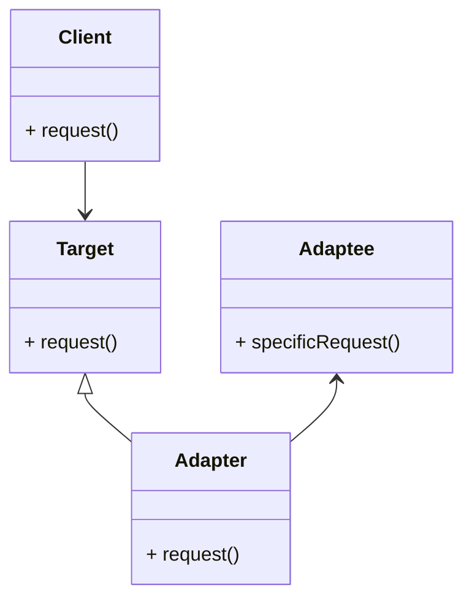

## 轉接器模式
* 將一個類的介面轉換成客戶希望的另外一個介面，轉接器模式使得原本由於介面不相容而不能一起工作的那些類可以一起工作。
* 當系統的資料和行為都正確但介面不符時，我們應該考慮用轉接器，目的是使控制範圍之外的原有物件與某個介面匹配。
* 轉接器模式主要應用於希望重複使用一些現存的類別，但是介面又與重複使用環境要求不一致的情況。

### UML 結構



```java
// Target interface
class Target {
    public void request() {
        System.out.println("Target request");
    }
}
// Adaptee class
class Adaptee {
    public void specificRequest() {
        System.out.println("Adaptee specific request");
    }
}
// Adapter class
class Adapter extends Target {
    private Adaptee adaptee = new Adaptee();

    public void request() {
        adaptee.specificRequest(); // delegate to Adaptee
    }
}
// Client
Target target = new Adapter();
target.request(); // calls Adaptee's specificRequest
```

## 何時使用轉接器模式
* 使用一個已經存在的類別，但如果它的介面，也就是它的方法和你的要求不相同時，就應該考慮用轉接器模式。
* 兩個類別所做的事情相同或相似，但具有不同的介面時要使用它。
* 客戶程式可以統一呼叫同一介面就行了，這樣可以更簡單、更直接、更緊湊。
* 雙方都不太容易修改的時候再使用轉接器模式調配。


## 籃球翻譯轉接器
```java

// player
abstract class Player {
    protected String name;
    public Player(String name) {
        this.name = name;
    }
    public abstract void attack();
    public abstract void defense();
}

// forward player
class Forward extends Player {
    public Forward(String name) {
        super(name);
    }
    public void attack() {
        System.out.println(name + " is attacking as a forward.");
    }
    public void defense() {
        System.out.println(name + " is defending as a forward.");
    }
}
// center player
class Center extends Player {
    public Center(String name) {
        super(name);
    }
    public void attack() {
        System.out.println(name + " is attacking as a center.");
    }
    public void defense() {
        System.out.println(name + " is defending as a center.");
    }
}

// guard player
class Guard extends Player {
    public Guard(String name) {
        super(name);
    }
    public void attack() {
        System.out.println(name + " is attacking as a guard.");
    }
    public void defense() {
        System.out.println(name + " is defending as a guard.");
    }
}

//client 
Player forward = new Forward("James");
forward.attack();

Player center = new Center("Jordan");
center.attack();
center.defense();

Player guard = new Guard("Kobe");
guard.attack();
```

```java
// foreign player
class ForeignPlayer {
    private String name;
    public String getName() {
        return this.name;
    }
    public void setName(String name) {
        this.name = name;
    }
    public void 攻擊() {
        System.out.println(this.name + " is attacking.");
    }
    public void 防守() {
        System.out.println(this.name + " is defending.");
    }
}
// translator adapter
class TranslatorAdapter extends Player {
    private ForeignPlayer foreignPlayer = new ForeignPlayer();

    public TranslatorAdapter(String name) {
        super(name);
        foreignPlayer.setName(name);
    }

    public void attack() {
        foreignPlayer.attack();
    }

    public void defense() {
        foreignPlayer.defense();
    }
}

// client
Player forwards = new Forward("James");
forwards.attack();

Player guard = new Guard("Kobe");
guard.attack();

Player foreignPlayer = new TranslatorAdapter("Yao Ming");
foreignPlayer.attack();
foreignPlayer.defense();