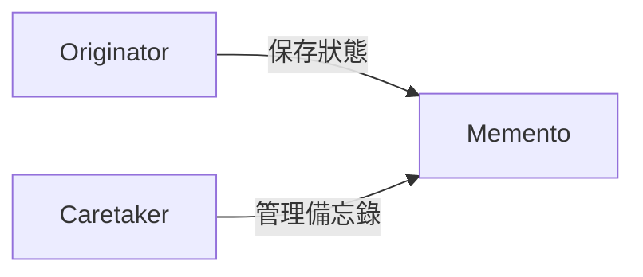
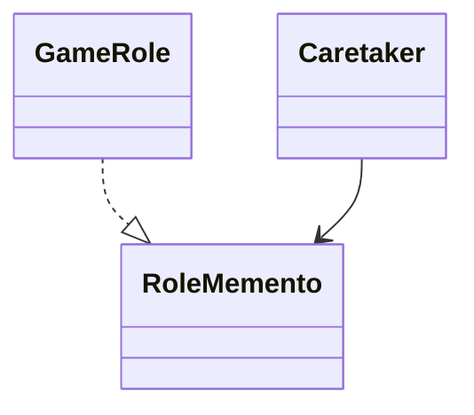

## 備忘錄模式

## 遊戲存進度

```java
class GameRole {
    private int vitality;
    public int getVitality() {
        return this.vitality;
    }
    public void setVitality(int vitality) {
        this.vitality = vitality;
    }

    private int attack;
    public int getAttack() {
        return this.attack;
    }
    public void setAttack(int attack) {
        this.attack = attack;
    }

    private int defense;
    public int getDefense() {
        return this.defense;
    }
    public void setDefense(int defense) {
        this.defense = defense;
    }

    public void displayState() {
        System.out.println("體力：" + this.vitality + "，攻擊力：" + this.attack + "，防禦力：" + this.defense);
    }

    public void initState() {
        this.vitality = 100;
        this.attack = 100;
        this.defense = 100;
    }

    public void fight() {
        this.vitality = 0;
        this.attack = 0;
        this.defense = 0;
    }
}

// client
GameRole role = new GameRole();
role.initState();
role.displayState();

GameRole backup = new GameRole();
backup.setVitality(role.getVitality());
backup.setAttack(role.getAttack());
backup.setDefense(role.getDefense());

role.fight();
role.displayState();

role.setVitality(backup.getVitality());
role.setAttack(backup.getAttack());
role.setDefense(backup.getDefense());

role.displayState();
```

## 備忘錄模式
* 備忘錄：在不破壞封裝性的前提下，捕獲一個對象的內部狀態，並在該對象之外保存這個狀態。這樣以後就可以將對象恢復到原先保存的狀態。



* Originator：創建備忘錄的對象，負責保存當前狀態。
* Memento：備忘錄對象，保存 Originator 的狀態。
* Caretaker：負責保存和恢復備忘錄的對象。

```java
// Originator
class Originator {
    private String state;
    public String getState() {
        return this.state;
    }
    public void setState(String state) {
        this.state = state;
    }
    public void show() {
        System.out.println("狀態：" + this.state);
    }
    public Memento createMemento() {
        return new Memento(this.state);
    }
    public void restoreMemento(Memento memento) {
        this.state = memento.getState();
    }
}

// Memento
class Memento {
    private String state;
    public Memento(String state) {
        this.state = state;
    }
    public String getState() {
        return this.state;
    }
    public void setState(String state) {
        this.state = state;
    }
}

// Caretaker
class Caretaker {
    private Memento memento;
    public Memento getMemento() {
        return this.memento;
    }
    public void setMemento(Memento memento) {
        this.memento = memento;
    }
}
// client
Originator originator = new Originator();
originator.setState("on");
originator.show();

Caretaker caretaker = new Caretaker();
caretaker.setMemento(originator.createMemento());
originator.setState("off");
originator.show();

originator.restoreMemento(caretaker.getMemento());
originator.show();
```

* Memento 模式比較適用於功能比較複雜但需要維護或記錄屬性歷史的類別，或需要儲存的屬性只是許多屬性中的一小部分時，Originator 可以根據儲存的 Memento 資訊還原到前一狀態。

* 如果在某個系統中使用命令模式時需要實現命令的撤銷功能，那麼命令模式可以使用備忘錄模式來儲存可撤銷操作的狀態。

* 當角色的狀態改變的時候，有可能這個狀態無效，這時候就可以使用暫時儲存起來的備忘錄將狀態復原。

## 遊戲進度備忘


```java
class GameRole {
   public RoleStateMemento saveState() {
        return new RoleStateMemento(this.vitality, this.attack, this.defense);
    }

    public void restoreState(RoleStateMemento memento) {
        this.vitality = memento.getVitality();
        this.attack = memento.getAttack();
        this.defense = memento.getDefense();
    }
}

// RoleStateMemento
class RoleStateMemento{
    private int vitality;
    private int attack;
    private int defense;

    public RoleStateMemento(int vitality, int attack, int defense) {
        this.vitality = vitality;
        this.attack = attack;
        this.defense = defense;
    }
    public int getVitality() {
        return vitality;
    }
    public int getAttack() {
        return attack;
    }
    public int getDefense() {
        return defense;
    }

    public void setVitality(int vitality) {
        this.vitality = vitality;
    }

    public void setAttack(int attack) {
        this.attack = attack;
    }

    public void setDefense(int defense) {
        this.defense = defense;
    }
}

// RoleStateCaretaker
class RoleStateCaretaker {
    private RoleStateMemento memento;

    public RoleStateMemento getMemento() {
        return this.memento;
    }

    public void setMemento(RoleStateMemento value) {
        this.memento = value;
    }
}

// client
GameRole role = new GameRole();
role.initState();
role.displayState();

// Save the current state
RoleStateCaretaker caretaker = new RoleStateCaretaker();
caretaker.setMemento(role.saveState());

// Fight and change the state
role.fight();
role.displayState();

// Restore the state from the memento
role.recoverState(caretaker.getMemento());
role.displayState();
```

