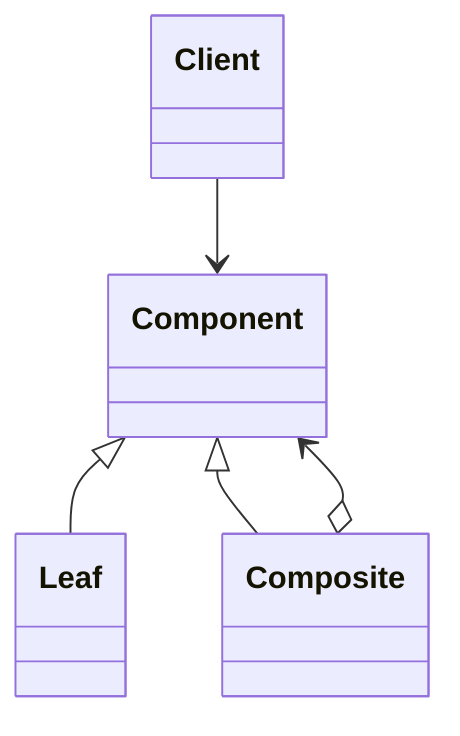
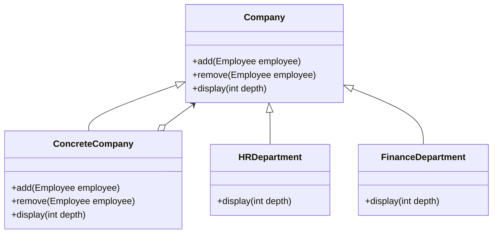

## 組合模式
* 組合模式（Composite Pattern）將物件組合成樹狀結構，以表示「部分-整體」的層次關係。這種模式讓使用者能以一致的方式操作單一物件與組合物件。



```java
abstract class Component {
    protected String name;
    public Component(String name) { this.name = name; }
    public abstract void add(Component component);
    public abstract void remove(Component component);
    public abstract void display(int depth);
}

class Leaf extends Component {
    public Leaf(String name) { super(name); }
    public void add(Component component) {
        throw new UnsupportedOperationException("Leaf nodes cannot add components.");
    }
    public void remove(Component component) {
        throw new UnsupportedOperationException("Leaf nodes cannot remove components.");
    }
    public void display(int depth) {
        for (int i = 0; i < depth; i++) System.out.print("_");
        System.out.println("Leaf: " + name);
    }
}

class Composite extends Component {
    private ArrayList<Component> children = new ArrayList<>();
    public Composite(String name) { super(name); }
    public void add(Component component) { children.add(component); }
    public void remove(Component component) { children.remove(component); }
    public void display(int depth) {
        for (int i = 0; i < depth; i++) System.out.print("_");
        System.out.println("Composite: " + name);
        for (Component child : children) child.display(depth + 2);
    }
}

// client
Composite root = new Composite("Root");
root.add(new Leaf("Leaf A"));
root.add(new Leaf("Leaf B"));

Composite compositeX = new Composite("Composite X");
compositeX.add(new Leaf("Leaf X1"));
compositeX.add(new Leaf("Leaf X2"));
root.add(compositeX);

Composite compositeY = new Composite("Composite Y");
compositeY.add(new Leaf("Leaf Y1"));
compositeY.add(new Leaf("Leaf Y2"));
compositeX.add(compositeY);

Leaf leafC = new Leaf("Leaf C");
root.add(leafC);

Leaf leafD = new Leaf("Leaf D");
root.add(leafD);
root.remove(leafD);

root.display(1);
```

## 透明方式與安全方式
* 透明方式：在 Component 中宣告所有管理子物件的方法（如 add、remove），所有子類別都具備這些方法。好處是介面一致，但 Leaf 實現這些方法沒有意義。
* 安全方式：Component 不宣告 add、remove，僅 Composite 宣告管理方法。這樣 Leaf 不需實現無意義的方法，但介面不一致，使用時需判斷型別。

## 何時使用組合模式
* 當需求中存在部分與整體層次結構，且希望統一操作所有物件時，適合使用組合模式。

## 公司管理系統




```java
// company structure
abstract class Company {
    protected String name;
    public Company(String name) { this.name = name; }
    
    public abstract void add(Company company);
    public abstract void remove(Company company);
    public abstract void display(int depth);

    public abstract void lineOfDuty();
}

// company departments
class ConcreteCompany extends Company {
    protected ArrayList<Company> employees = new ArrayList<>();

    public ConcreteCompany(String name) { super(name); }

    public void add(Company company) { employees.add(company); }
    public void remove(Company company) { employees.remove(company); }

    public void display(int depth) {
        for (int i = 0; i < depth; i++) System.out.print("-");
        System.out.println("Company: " + name);
        for (Company emp : employees) emp.display(depth + 2);
    }

    public void lineOfDuty() {
        for (Company emp : employees) emp.lineOfDuty();
    }
}

// HR Department
class HRDepartment extends Company {
    public HRDepartment(String name) { super(name); }

    public void add(Company company) {
    }

    public void remove(Company company) {
    }

    public void display(int depth) {
        for (int i = 0; i < depth; i++) System.out.print("-");
        System.out.println("HR Department: " + name);
    }

    public void lineOfDuty() {
        System.out.println("HR Department is responsible for recruitment and employee management.");
    }
}

// Finance Department
class FinanceDepartment extends Company {
    public FinanceDepartment(String name) { super(name); }

    public void add(Company company) {
    }

    public void remove(Company company) {
    }

    public void display(int depth) {
        for (int i = 0; i < depth; i++) System.out.print("-");
        System.out.println("Finance Department: " + name);
    }

    public void lineOfDuty() {
        System.out.println("Finance Department is responsible for financial management.");
    }
}
// client
ConcreteCompany company = new ConcreteCompany("Tech Company");
company.add(new HRDepartment("HR Department"));
company.add(new FinanceDepartment("Finance Department"));

ConcreteCompany subCompany = new ConcreteCompany("Sub Company");
subCompany.add(new HRDepartment("Sub HR Department"));
subCompany.add(new FinanceDepartment("Sub Finance Department"));
company.add(subCompany);

ConcreteCompany company2 = new ConcreteCompany("Another Company");
company2.add(new HRDepartment("Another HR Department"));
company2.add(new FinanceDepartment("Another Finance Department"));
company.add(company2);

ConcreteCompany company3 = new ConcreteCompany("Third Company");
company3.add(new HRDepartment("Third HR Department"));
company3.add(new FinanceDepartment("Third Finance Department"));
company.add(company3);

System.out.println("Company Structure:");
company.display(1);
System.out.println("\nLine of Duty:");
company.lineOfDuty();
```

## 組合模式好處
* 組合模式定義了包括基本物件和組合物件的類別層次結構。基本物件可以被組合成更複雜的組合物件，而這個組合物件又可以被組合。這樣不斷遞迴下去，客戶端中任何用到物件的地方都可以使用組合物件了。
* 使用者不用關心到底是處理一個葉節點還是處理一個組合元件，也就用不著為定義組合而寫一些選擇判斷敘述了。
* 組合模式讓客戶可以一致地使用組合結構和單一物件。