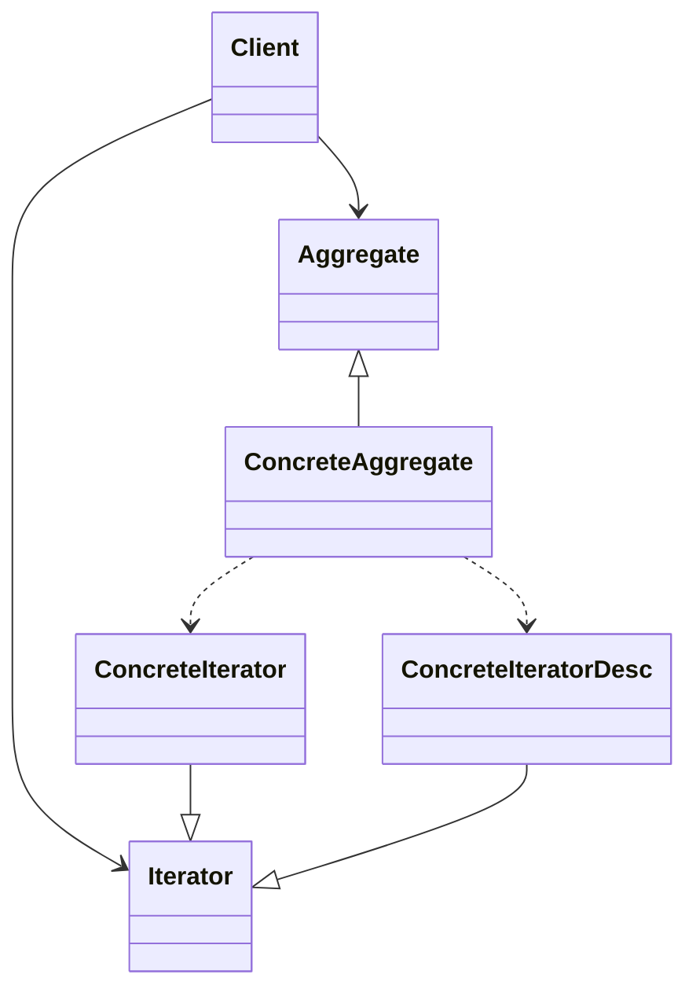

## 迭代器模式（Iterator Pattern）
* 迭代器模式（Iterator），提供一種方法循序訪問一個聚合物件中的各個元素，而不暴露該物件的內部表示。

需要對聚集有多種遍歷方式的集合進行操作時，可以考慮使用迭代器模式。
為不同的聚合結構提供統一的介面，如開始、下一個、是否結束、當前項等。

Aggregate（聚合抽象類）：定義創建迭代器物件的介面。
Iterator（迭代器抽象類）：定義訪問和遍歷聚合元素的介面。
ConcreteAggregate（具體聚合類）：實現創建迭代器物件的介面，並返回一個具體迭代器物件。
ConcreteIterator（具體迭代器類）：實現迭代器介面，負責遍歷聚合物件中的元素。
ConcreteIteratorDesc（具體迭代器類-反向）：實現迭代器介面，負責反向遍歷聚合物件中的元素。





```java
// Aggregate
abstract class Aggregate {
    public abstract Iterator createIterator();
}

// ConcreteAggregate
class ConcreteAggregate extends Aggregate {
    
    private ArrayList<Object> items = new ArrayList<Object>();
    public Iterator createIterator() {
        return new ConcreteIterator(this);
    }
    public int getCount() {
        return items.size();
    }
    public void add(Object obj) {
        items.add(obj);
    }
    publice Object get(int index) {
        return items.get(index);
    }
}
// Iterator
abstract class Iterator {
    public abstract Object first();
    public abstract Object next();
    public abstract boolean isDone();
    public abstract Object currentItem();
}
// ConcreteIterator
class ConcreteIterator extends Iterator {
    private ConcreteAggregate aggregate;
    private int current = 0;

    public ConcreteIterator(ConcreteAggregate aggregate) {
        this.aggregate = aggregate;
    }

    public Object first() {
        return aggregate.get(0);
    }

    public Object next() {
        Object obj = null;
        current++;
        if (current < aggregate.getCount()) {
            ret = aggregate.get(current);
        }
        return ret;
    }

    public boolean isDone() {
        return current >= aggregate.getCount() ? true : false;
    }

    public Object currentItem() {
        return aggregate.get(current);
    }
}

//client
ConcreteAggregate bus = new ConcreteAggregate();
bus.add("A");
bus.add("B");
bus.add("C");
Iterator conductor = new ConcreteIterator(bus);
conductor.first();
while (!conductor.isDone()) {
    System.out.println(conductor.currentItem());
    conductor.next();
}

// ConcreteIteratorDesc
class ConcreteIteratorDesc extends Iterator {
    private ConcreteAggregate aggregate;
    private int current;

    public ConcreteIteratorDesc(ConcreteAggregate aggregate) {
        this.aggregate = aggregate;
        this.current = aggregate.getCount() - 1;
    }

    public Object first() {
        return aggregate.get(aggregate.getCount() - 1);
    }

    public Object next() {
        Object ret = null;
        current--;
        if (current >= 0) {
            ret = aggregate.get(current);
        }
        return ret;
    }

    public boolean isDone() {
        return current < 0 ? true : false;
    }

    public Object currentItem() {
        return aggregate.get(current);
    }
}

```

### Java 內建迭代器

Java 提供了內建的迭代器介面 `Iterator`，可以用來遍歷集合物件，如 `ArrayList`、`HashSet` 等。

```java
import java.util.Iterator;
public interface Iterator{
    public boolean hasNext();
    public Object next();
}

import java.util.ListIterator;
public interface ListIterator{
    public boolean hasNext();
    public Object next();
    public boolean hasPrevious();
    public Object previous();
}

```

迭代器模式就是分離了集合物件的遍歷行為，抽象出一個迭代器類別來負責，這樣既可以做到不暴露集合的內部結構，又可讓外部程式透明地存取集合內部的資料。