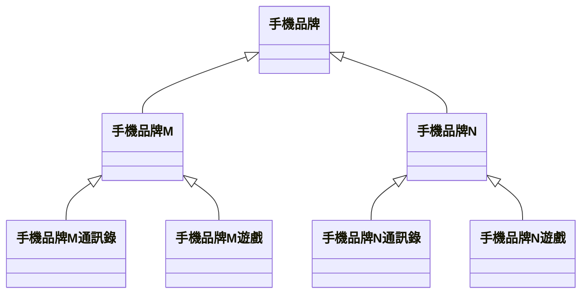
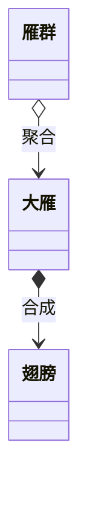
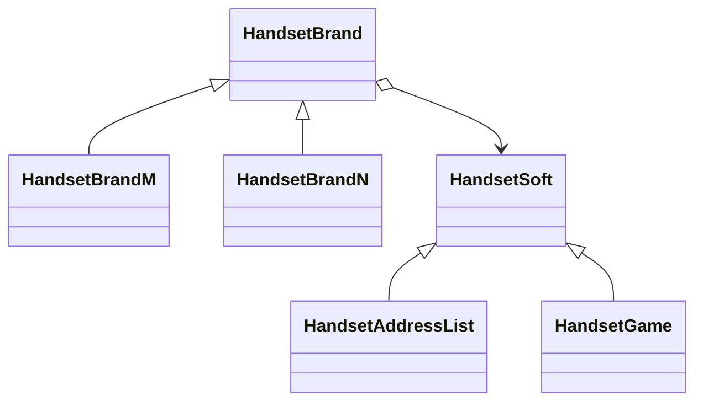
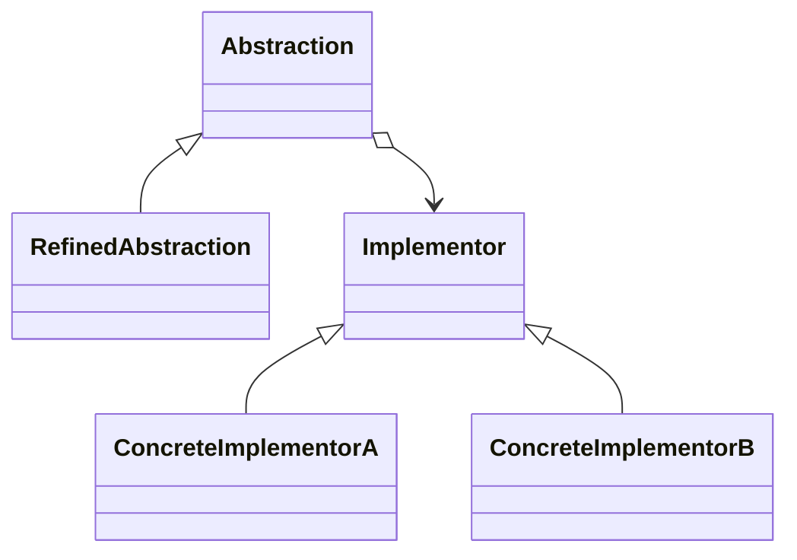

## Bridge Pattern

### 緊耦合的程式演化

```java
class HandsetBrandGame {
    public void run() {
        System.out.println("Running Handset Brand G Game");
    }
}
// Client code
HandsetBrandGame game = new HandsetBrandGame();
game.run();
```

```java
class HandsetGame {
    public void run() {
        System.out.println();
    }
}
class HandsetBrandGame extends HandsetGame {
    @Override
    public void run() {
        System.out.println("Running Handset Brand G Game");
    }
}
class HandsetBrandNGame extends HandsetGame {
    @Override
    public void run() {
        System.out.println("Running Handset Brand N Game");
    }
}
```

#### 結構圖



物件的繼承關係在編譯時就定義所以無法在執行時期改變從父類別繼承的實現。子類別的實現與他的父類別有非常緊密的依賴關係,以至於父類別實現中的任何變化必然會導致子類別發生變化。當你需要重複使用子類別時,如果繼承下來的實現不適合解決新的問題,則父類別必須重寫或被其他更適合的類別替換。這種依賴關係限制了靈活性並且限制了重複使用性。

### 合成/聚合重複使用原則
合成/聚合重複使用原則(Composition/Aggregation Reuse Principle, CARP),盡量使用合成/聚合,盡量不要使用類別繼承。
聚合表示一種弱的擁有關係,表現的是A物件可以包含B物件,但B物件不是A物件的一部分;合成則是一種強的擁有關係,表現了嚴格的部分和整體的關係,部分和整體的生命週期一樣。
For example:



優先使用物件的合成/聚合將有助於你保持每個類別被封裝,並被集中在單一任務上。這樣類別和類別繼承層次會保持較小規模,並且不太可能增長為不可控制的龐然大物。

結構圖:


### 鬆散耦合的程式

```java
// software abstraction
abstract class HandsetSoft {
    public abstract void run();
}
class HandsetGame extends HandsetSoft {
    @Override
    public void run() {
        System.out.println("Running Handset Game");
    }
}
class HandsetAddressList extends HandsetSoft {
    @Override
    public void run() {
        System.out.println("Running Handset Address List");
    }
}

// brand abstraction
abstract class HandsetBrand {
    protected HandsetSoft soft;
    public void setHandsetSoft(HandsetSoft soft) {
        this.soft = soft;
    }
    public abstract void run();
}

class HandsetBrandM extends HandsetBrand {
    @Override
    public void run() {
        System.out.print("Handset Brand M: ");
        soft.run();
    }
}
class HandsetBrandN extends HandsetBrand {
    @Override
    public void run() {
        System.out.print("Handset Brand N: ");
        soft.run();
    }
}

// Client code
HandsetBrand brand;
brand = new HandsetBrandM();

brand.setHandsetSoft(new HandsetGame());
brand.run();

brand.setHandsetSoft(new HandsetAddressList());
brand.run();

HandsetBrand b2;
b2 = new HandsetBrandN();

b2.setHandsetSoft(new HandsetGame());
b2.run();

b2.setHandsetSoft(new HandsetAddressList());
b2.run();

// add new brand or software without changing existing code
class HandsetMusic extends HandsetSoft {
    @Override
    public void run() {
        System.out.println("Running Handset Music");
    }
}
class HandsetBrandX extends HandsetBrand {
    @Override
    public void run() {
        System.out.print("Handset Brand X: ");
        soft.run();
    }
}
```

### 橋接模式
橋接模式(Bridge),將抽象部分與它的實現部分分離,使它們都可以獨立地變化。
甚麼叫抽象與它的實現分離,這並不是說讓抽象類別與其衍生類別分離,因為這沒有任何意義。實現指的是抽象類別和它的衍生類別用來實現自己的物件。

### 橋接模式基本程式
結構圖:



```java
// Implementor
abstract class Implementor {
    public abstract void operationImpl();
}
// ConcreteImplementorA
class ConcreteImplementorA extends Implementor {
    @Override
    public void operationImpl() {
        System.out.println("ConcreteImplementorA operation");
    }
}
// ConcreteImplementorB
class ConcreteImplementorB extends Implementor {
    @Override
    public void operationImpl() {
        System.out.println("ConcreteImplementorB operation");
    }
}
// Abstraction
abstract class Abstraction {
    protected Implementor implementor;
    public void setImplementor(Implementor implementor) {
        this.implementor = implementor;
    }
    public abstract void operation();
}
// RefinedAbstraction
class RefinedAbstraction extends Abstraction {
    @Override
    public void operation() {
        implementor.operationImpl();
    }
}
// Client code
Abstraction ab = new RefinedAbstraction();
ab = new RefinedAbstraction();

ab.setImplementor(new ConcreteImplementorA());
ab.operation();

ab.setImplementor(new ConcreteImplementorB());
ab.operation();
```

實現系統可能有多角度分類,每一種分類都有可能變化,那麼就把這種多角度分離出來讓他們獨立變化,減少它們之間的耦合。
