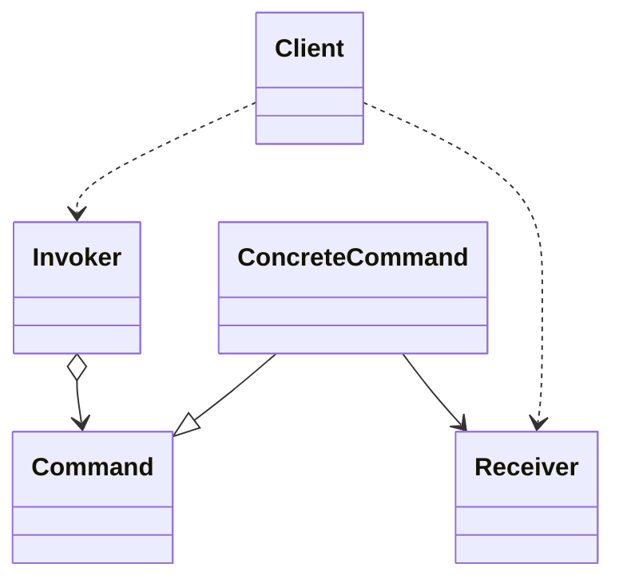
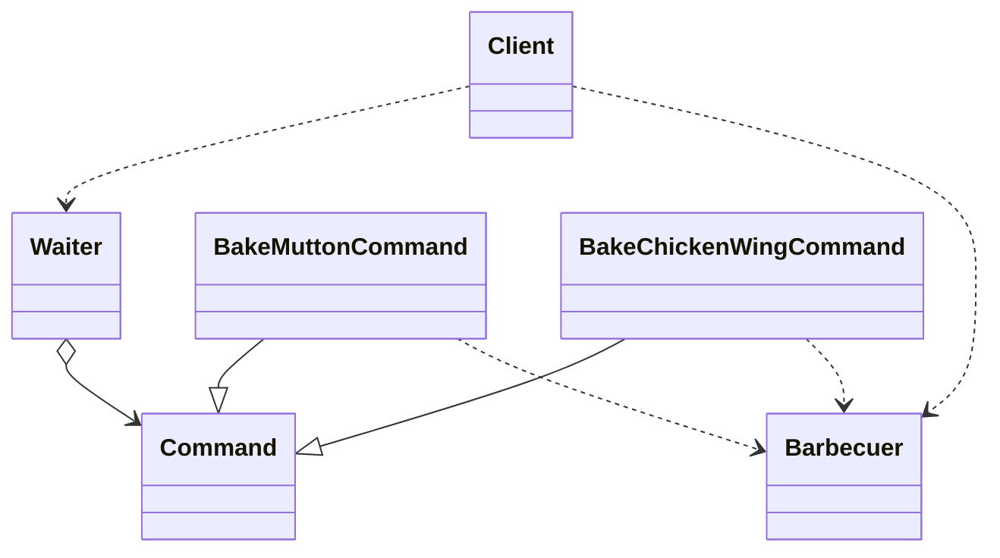

## Command Pattern

### 緊耦合設計

結構圖:
用戶端 -> 烤肉業者

```java
class Barbecuer {
    public void bakeMutton() {
        System.out.println("烤羊肉串!");
    }

    public void bakeChickenWing() {
        System.out.println("烤雞翅!");
    }
}
//client
Barbecuer barbecuer = new Barbecuer();
barbecuer.bakeMutton();
barbecuer.bakeMutton();
barbecuer.bakeMutton();
barbecuer.bakeChickenWing();

barbecuer.bakeMutton();
barbecuer.bakeMutton();
barbecuer.bakeChickenWing();
```
### 命令模式
命令模式(Command Pattern)將一個請求封裝為一個物件,從而使你可用不同的請求對客戶進行參數化,對請求排隊或記錄請求日誌,以及支援可撤銷的操作



```java
// abstract Command
abstract class Command {
    protected Barbecuer receiver;

    public Command(Barbecuer receiver) {
        this.receiver = receiver;
    }

    public abstract void executeCommand();
}
// ConcreteCommand
class BakeMuttonCommand extends Command {
    public BakeMuttonCommand(Barbecuer receiver) {
        super(receiver);
    }

    @Override
    public void executeCommand() {
        receiver.bakeMutton();
    }
}
// invoker
class Invoker {
    private Command command;

    public void setCommand(Command command) {
        this.command = command;
    }
    public void executeCommand() {
        command.executeCommand();
    }
}

// Receiver
class Receiver {
    public void action() {
        System.out.println("Receiver action executed.");
    }
}

// Client code
Barbecuer barbecuer = new Barbecuer();
Command bakeMuttonCommand = new BakeMuttonCommand(barbecuer);
Invoker invoker = new Invoker();
invoker.setCommand(bakeMuttonCommand);
invoker.executeCommand();
```

### 鬆散耦合設計


```java
// Barbecuer
class Barbecuer {
    public void bakeMutton() {
        System.out.println("烤羊肉串!");
    }

    public void bakeChickenWing() {
        System.out.println("烤雞翅!");
    }
}

// abstract Command
abstract class Command {
    protected Barbecuer receiver;

    public Command(Barbecuer receiver) {
        this.receiver = receiver;
    }

    public abstract void executeCommand();
}
// ConcreteCommand for Mutton
class BakeMuttonCommand extends Command {
    public BakeMuttonCommand(Barbecuer receiver) {
        super(receiver);
    }

    @Override
    public void executeCommand() {
        receiver.bakeMutton();
    }
}
// ConcreteCommand for Chicken Wing
class BakeChickenWingCommand extends Command {
    public BakeChickenWingCommand(Barbecuer receiver) {
        super(receiver);
    }

    @Override
    public void executeCommand() {
        receiver.bakeChickenWing();
    }
}

// Waiter
class Waiter {
    private Command command;
    
    public void setOrder(Command command) {
        this.command = command;
    }
    public void notifyCommand() {
        command.executeCommand();
    }
}

// Client code
Barbecuer barbecuer = new Barbecuer();
Command bakeMuttonCommand = new BakeMuttonCommand(barbecuer);
Command bakeChickenWingCommand = new BakeChickenWingCommand(barbecuer);
Waiter waiter = new Waiter();
waiter.setOrder(bakeMuttonCommand);
waiter.notifyCommand();
waiter.setOrder(bakeChickenWingCommand);
waiter.notifyCommand();

```

### 進一步改進命令模式
```java
// waiter class
class Waiter {
    private List<Command> orders = new ArrayList<>();

    public void setOrder(Command command) {
        String commandName = command.getClass().getSimpleName();
        if (commandName.equals("BakeMuttonCommand") || commandName.equals("BakeChickenWingCommand")) {
            orders.add(command);
            System.out.println("增加訂單: " + commandName);
        } else {
            System.out.println("不支援的訂單: " + commandName);
        }
    }

    public void cancelOrder(Command command) {
        String commandName = command.getClass().getSimpleName();
        orders.remove(command);
        System.out.println("取消訂單: " + commandName);
    }
    public void notifyCommands() {
        for (Command command : orders) {
            command.executeCommand();
        }
    }
    private String getNowTime() {
        SimpleDateFormat format = new SimpleDateFormat("yyyy-MM-dd HH:mm:ss");
        return format.format(new Date()).toString();
    }
}
// Client code
Barbecuer barbecuer = new Barbecuer();
Command bakeMuttonCommand1 = new BakeMuttonCommand(barbecuer);
Command bakeChickenWingCommand1 = new BakeChickenWingCommand(barbecuer);

Waiter waiter = new Waiter();
waiter.setOrder(bakeMuttonCommand1);
waiter.setOrder(bakeMuttonCommand1);
waiter.setOrder(bakeMuttonCommand1);
waiter.setOrder(bakeMuttonCommand1);

waiter.cancelOrder(bakeMuttonCommand1);

waiter.setOrder(bakeChickenWingCommand1);

waiter.notifyCommands();
```

### 命令模式作用
1. 能較容易地設計一個命令佇列 
2. 在需要的情況下 可以較容易地將命令記入日誌
3. 允許接收請求的一方決定是否否決請求
4. 可以容易地實現對請求的撤銷和重作
5. 由於加入新的具體命令類別不影響其他類別 因此增加新的具體命令類別容易
命令模式把請求一個操作的物件與知道怎麼執行一個操作的物件分割開
敏捷開發原則告訴我們 不要為程式增加基於猜測 實際不需要的功能 如果不清楚一個系統是否需要命令模式 一般就不要著急去實現它 事實上在需要的時候透過重構實現這個模式並不困難 只有在真正需要如撤銷恢復操作等功能時 把原來的程式重構為命令模式才有意義