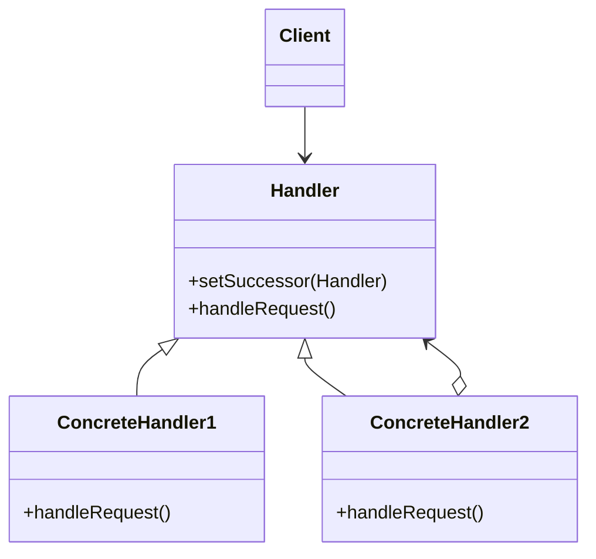
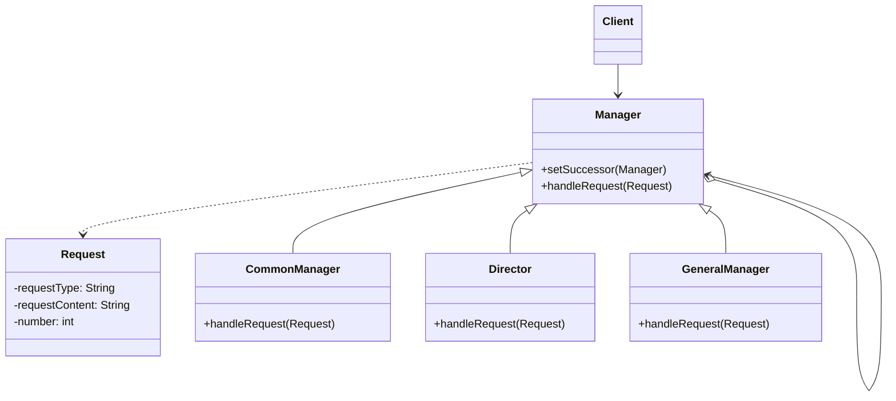

## Chain of Responsibility Pattern

### 加薪程式初步

```java

class Request {
    private String requestType;
    public String getRequestType() {
        return this.requestType;
    }
    public void setRequestType(String requestType) {
        this.requestType = requestType;
    }

    private String requestContent;
    public String getRequestContent() {
        return this.requestContent;
    }
    public void setRequestContent(String requestContent) {
        this.requestContent = requestContent;
    }

    private int number;
    public int getNumber() {
        return this.number;
    }
    public void setNumber(int number) {
        this.number = number;
    }
}
```

```java
//manager
class Manager {
    protected String name;
    public Manager(String name) {
        this.name = name;
    }

    public void getResult(String managerLevel, Request request) {
        if (managerLevel.equals("manager")) {
            if (request.getRequestType() == "請假" && request.getNumber() <= 2) {
                System.out.println(this.name + "審批了" + request.getRequestContent());
            } else {
                System.out.println("請假天數過多，無法審批");
            }
        } 
        else if (managerLevel.equals("director")) {
            if (request.getRequestType() == "請假" && request.getNumber() <= 5) {
                System.out.println(this.name + "審批了" + request.getRequestContent());
            } else {
                System.out.println("請假天數過多，無法審批");
            }
        }
        else if (managerLevel.equals("generalManager")) {
            if (request.getRequestType() == "請假") {
                System.out.println(this.name + "審批了" + request.getRequestContent());
            } else if (request.getRequestType() == "加薪" && request.getNumber() <= 500) {
                System.out.println(this.name + "審批了" + request.getRequestContent());
            } else {
                System.out.println("加薪金額過高，無法審批");
            }
        }
        else if (request.getRequestType() == "加薪" && request.getNumber() > 5000) 
        {
            System.out.println("加薪金額過高，無法審批");
        }
    }
}
```

```java
// client
Manager manager = new Manager("經理");
Manager director = new Manager("主管");
Manager generalManager = new Manager("總經理");

Request request = new Request();
request.setRequestType("加薪");
request.setRequestContent("小明申請加薪");
request.setNumber(6000);
manager.getResult("manager", request);
director.getResult("director", request);
generalManager.getResult("generalManager", request);

Request request2 = new Request();
request2.setRequestType("請假");
request2.setRequestContent("小紅申請請假");
request2.setNumber(4);

manager.getResult("manager", request2);
director.getResult("director", request2);
generalManager.getResult("generalManager", request2);
```

### 職責鏈模式
職責鏈模式（Chain of Responsibility Pattern）: 使多個物件都有機會處理請求，從而避免請求的發送者和接收者之間的耦合關係，將這個物件連成一條鏈，並沿著這條鏈傳遞該請求，直到有一個物件處理它為止。

結構圖:



```java
abstract class Handler {
    protected Handler successor;

    public void setSuccessor(Handler successor) {
        this.successor = successor;
    }

    public abstract void handleRequest(Request request);
}

class ConcreteHandler1 extends Handler {
    public void handleRequest(Request request) {
        if (request >= 0 && request < 10) {
            System.out.println("ConcreteHandler1處理請求: " + request);
        } else if (successor != null) {
            successor.handleRequest(request);
        }
    }
}
class ConcreteHandler2 extends Handler {
    public void handleRequest(Request request) {
        if (request >= 10 && request < 20) {
            System.out.println("ConcreteHandler2處理請求: " + request);
        } else if (successor != null) {
            successor.handleRequest(request);
        }
    }
}
class ConcreteHandler3 extends Handler {
    public void handleRequest(Request request) {
        if (request >= 20 && request < 30) {
            System.out.println("ConcreteHandler3處理請求: " + request);
        } else if (successor != null) {
            successor.handleRequest(request);
        }
    }
}

Handler handler1 = new ConcreteHandler1();
Handler handler2 = new ConcreteHandler2();
Handler handler3 = new ConcreteHandler3();
handler1.setSuccessor(handler2);
handler2.setSuccessor(handler3);
int[] requests = {2, 5, 14, 22, 18, 3, 27, 20};
for (int request : requests) {
    handler1.handleRequest(request);
}
```

### 好處
當客戶提交一個請求時，請求沿著鏈傳遞直到有一個 concreteHandler 物件負責處理它。
接收者和發送者都沒有對方的明確資訊，且鏈中的物件自己也不知道鏈的結構。結果是職責鏈可簡化物件的相互連接，它們僅需保持一個指向其後繼者的引用，而不需保持它所有的候選接受者的引用。
隨時地增加或修改處理一個請求的結構，增強了給物件指派職責的靈活性。
一個請求極有可能到了鏈的末端都得不到處理，或因為沒有正確設定而得不到處理。

### 加薪程式重購

結構圖:



```java

